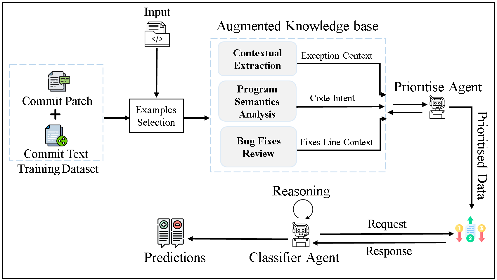

# Replication package for paper "LLM-Based Identification of Null Pointer Exception Patches"



LLM-Based Identification of Null Pointer Exception Patches This repo uses Large Language Models (LLMs) to identify and classify Null Pointer Exception (NPE) patches in code commits, combining contextual embeddings and AST features for automated NPE fix Identification and classification in software development.

# Augmented Agentic Commit Classification (AACC)  
## Identifying and Classifying Null Pointer Exception (NPE) Fixes  

## 🚀 Overview  

Null Pointer Exceptions (**NPEs**) are one of the primary causes of **software crashes** and **runtime errors**, making them a significant challenge for developers.  

Existing approaches for identifying and classifying NPE-related fixes often suffer from:  
- **Noisy or irrelevant data**  
- **Lack of contextual understanding**  
- **Inefficient processing of large and imbalanced datasets**  

To overcome these limitations, we introduce **Augmented Agentic Commit Classification (AACC)** — a novel method designed to accurately classify commit patches as **NPE fixes or non-NPE**.  

📊 **Performance Boost**: Our evaluation using **ChatGPT-4o** shows that AACC **outperforms state-of-the-art models**, improving the **F1 score from 72.07% to 98.03%**.

---

## 🔑 Key Features  

AACC incorporates four major advancements to enhance the detection of NPE fixes:  

### ✅ Best Example Selection  
- Filters **high-quality, contextually relevant commits**, ensuring the model learns from meaningful and accurate data.  

### 📚 Augmented Knowledge Base  
- Combines **contextual metadata, program semantics, and bug-fix patterns** for enriched classification.  

### 🎯 Prioritize Agent  
- **Ranks commits based on relevance and impact**, optimizing resource allocation and improving classification efficiency.  

### 🔄 Iterative Refinement Process  
- Uses **feedback loops** to **learn from misclassifications**, reducing false negatives and improving overall accuracy.  

---

## 📁 Folder Structure  
```
📦 AACC/
│── 📂 Dataset/
# Labeled datasets for training, testing, and evaluation
│ ├── 📝 NPEPatches.json # commit patches and messages, stack trace, and metadata of commits
│ ├── 📝 preprocessed.json # Cleaned and structured dataset
│ ├── 📝 labeled_data # Human-annotated NPE-fixes and non-NPE commits
│ │── 📂 Baselines_Evaluation/ # Comparative evaluation of AACC vs SOTA approaches
│ ├── 📜 models/ # Implementations of baseline models
│ ├── 📜 performance_metrics/ # precision, recall F1 scores, accuracy, and comparative results
│ │── 📂 LLMS/ # LLM-based classification models and components
│ ├── 🤖 fine_tuned_models/ # Pre-trained models adapted for NPE classification
│ ├── 📜 inference_scripts/ # Scripts to identify and classify new commit patches
│ │── 📜 run_classification.py # Main script to run AACC classification
│ │── 📜 requirements.txt # Required dependencies
│ │── 📜 README.md # Project documentation
```

---
## ⚙️ Getting Started  
## 📌 Requirements  

To run the **Augmented Agentic Commit Classification (AACC)** project, you need to have the following dependencies installed. These dependencies can be easily installed using `pip`.  

### 🖥️ System Requirements  
- **Python 3.8 or higher**  

### 📦 Python Libraries  
- **torch**: Required for PyTorch-based model embeddings and deep learning operations.  
- **transformers**: Provides pre-trained language models for commit classification.  
- **sentence-transformers**: Used for generating contextual embeddings of commit messages.  
- **pandas**: Used for reading, processing, and handling structured datasets.  
- **scikit-learn**: Provides machine learning utilities for classification and evaluation.  
- **openai**: Required to interact with OpenAI models like **ChatGPT-4o** for enhanced commit analysis.  
- **anthropic**: Used to interact with **Claude Sonnet** for advanced language processing.  
- **groq**: Required for using **DeepSeek-r1** and **Llama** models via Groq API.  

### 🌐 API Keys  
This project integrates multiple **LLMs** for commit classification. Ensure you have API keys set up for:  

- **Groq API** (`GROQ_API_KEY`) → Supports **DeepSeek-r1** and **Llama** models.  
- **OpenAI API** (`OPENAI_API_KEY`) → Used for **ChatGPT-4o** and other OpenAI models.  
- **Gemini API** (`GEMINI_API_KEY`) → Required for Google’s **Gemini AI**.  
- **Anthropic API** (`ANTHROPIC_API_KEY`) → Used for **Claude Sonnet**.  

Store these keys in your environment variables or in a `.env` file for secure access.

```bash
export GROQ_API_KEY="your-groq-api-key-here"
export OPENAI_API_KEY="your-openai-api-key-here"
export GEMINI_API_KEY="your-gemini-api-key-here"
export ANTHROPIC_API_KEY="your-anthropic-api-key-here"
```

## Directory Structure

This section provides an overview of the repository structure, including datasets, and the source code of the Code Completion models: [Dataset](https://drive.google.com/file/d/1PQ-7OXFEPbbS-mbG9dO2Fm6dcFSjpCug/view?usp=sharing), [Baseline evaluation models](https://github.com/NPE-Identification/NullPointerException/tree/main/Baselines), [LLMs](https://github.com/NPE-Identification/NullPointerException/tree/main/LLM_based_evaluations)

## Download Dataset

Due to size limits, the dataset has been uploaded to the Google Drive. You can download the dataset using the link below:

- [Download Dataset from Google Drive](https://drive.google.com/file/d/1PQ-7OXFEPbbS-mbG9dO2Fm6dcFSjpCug/view?usp=sharing)
  
